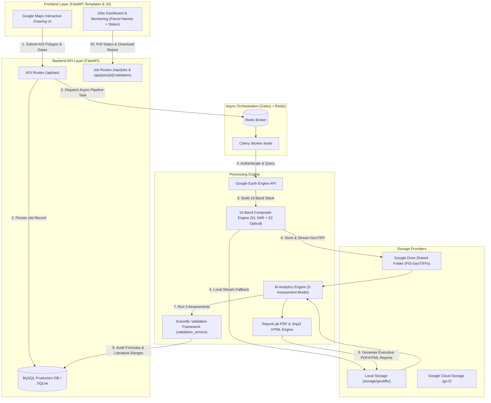

# 🌲 Forest Intelligence System (FIS)

> **Enterprise Geospatial Satellite Processing, AI Raster Inference & Scientific Forest Validation Engine**

[](https://www.python.org/)
[](https://fastapi.tiangolo.com/)
[](https://earthengine.google.com/)
[](LICENSE)

---

## 📌 Executive Overview

The **Forest Intelligence System (FIS)** is an enterprise-grade remote sensing and geospatial AI platform that automates satellite data fusion, raster analytics, biomass carbon accounting, and scientifically valid forest health diagnostics.

By replacing manual, ad-hoc Earth Engine script runs with an automated background pipeline, FIS enables environmental scientists, carbon project developers, and forest conservation managers to draw an Area of Interest (AOI) on an interactive map and instantly obtain:
- **10-Band Dual-Sensor Satellite Composites** (Sentinel-1 SAR C-Band + Sentinel-2 Optical)
- **Current Vegetation Condition** & **Multi-Temporal Forest Health** diagnostics
- **Reforestation & Conservation Suitability Scoring** (0–100)
- **IPCC Tier 1 Carbon Stock** and $\text{CO}_2\text{e}$ Sequestration Offsets
- **Scientific Validation & Peer Literature Audits** with categorical confidence ratings (`High`, `Medium`, `Low`)
- **Automated Executive PDF & HTML Reports**

---

## 🏛️ System Architecture



---

## 🔬 Scientific Assessment Framework

Rather than using monolithic or arbitrary thresholds, FIS separates forest analytics into **three independent, scientifically grounded assessment modules**:

### 1. Current Vegetation Condition (Single-Period Analysis)
*Evaluates vegetation state using ONLY the current observation window ($< 180\text{ days}$).*
- **Indicators**: Canopy Cover %, Biomass Density (t/ha), Optical NDVI, Moisture NDMI, SAR VH Backscatter (dB).
- **Classifications**: **`Excellent`**, **`Good`**, **`Moderate`**, **`Sparse`**.
- *Scientific Principle*: A single observation date cannot determine degradation; it measures current vegetation condition.

### 2. Forest Health Score (Multi-Temporal Analysis)
*Evaluates temporal trend stability across historical observations.*
- **Requirement**: Minimum **180 days (6 months)** of observation history required.
- **Classifications**: **`Healthy`**, **`Moderate`**, **`Stressed`**, **`Degraded`** (or **`Unavailable`** if $< 180\text{ days}$).
- *Scientific Principle*: Forest degradation is a multi-temporal trend requiring historical comparison. Single-window analyses explicitly return `available: false` with detailed reasoning.

### 3. Reforestation & Conservation Suitability Score (0–100)
*Independent environmental suitability for tree planting and conservation.*
- **Weighted Factors**: Canopy Gap Potential (35%), Soil/Vegetation Moisture NDMI (30%), Biomass Capacity (20%), Water Reserve Factor (15%).
- **Classifications**: **`Highly Suitable`**, **`Suitable`**, **`Moderately Suitable`**, **`Low Suitability`**.

---

## 🧪 Scientific Validation Framework (`validation_service`)

FIS incorporates a dedicated validation and auditing module that verifies predictions without modifying raw output values:

1. **Formula Verification & Academic Citations**:
   - **NDVI**: $\frac{B8 - B4}{B8 + B4}$ *(Rouse et al., 1974)*
   - **NDMI**: $\frac{B8 - B11}{B8 + B11}$ *(Gao, 1996)*
   - **Biomass**: SAR VH backscatter dB & optical density modeling *(Saatchi et al., 2011; IPCC Tier 1)*
   - **Carbon**: $\text{Biomass} \times 0.47$ *(IPCC 2006 Guidelines for National Greenhouse Gas Inventories)*
   - **$\text{CO}_2\text{e}$ Offset**: $\text{Carbon} \times \frac{44}{12} = \text{Carbon} \times 3.67$ *(IPCC Tier 1 Framework)*

2. **Ecosystem Literature Reference Database**:
   - Benchmarks predictions against 4 major biomes: **Tropical Moist Forest**, **Mangrove / Coastal Wetland**, **Subtropical / Temperate Forest**, and **Dry Forest / Woodland**.
   - Reports expected vs. predicted values with `PASS` or `FLAGGED` status.

3. **Cross-Dataset Validation**:
   - Audits predictions against **ESA WorldCover 10m** and **Hansen Global Forest Change (GFW 30m)** baselines.
   - Computes absolute difference, percentage difference, and average agreement %.

4. **Categorical Confidence Rating System**:
   - Calculates confidence as **`High`**, **`Medium`**, or **`Low`** based on cloud cover %, observation window, band stack completeness, and baseline dataset agreement (never arbitrary float guesses).

---

## 🌟 Key Platform Features

- **Interactive Map & Polygon Validator**: Google Maps drawing interface with Shoelace planar area calculation, vertex bounds validation (3–100 vertices), max area cap (**5,000 ha**), and server-side Shapely topology checks.
- **Stateful Asynchronous Task Queue**: Celery + Redis pipeline with real-time status transitions (`PENDING` $\to$ `EXPORTING` $\to$ `EXPORTED` $\to$ `ANALYZING` $\to$ `COMPLETED`).
- **Flexible Storage Backends**: Supports **Google Drive** (`STORAGE_BACKEND=drive`), **Local Storage** (`STORAGE_BACKEND=local`), and **Google Cloud Storage** (`STORAGE_BACKEND=gcs`). Automatically cleans up temporary files after analysis to save Drive quota.
- **MySQL & SQLite Support**: Configurable database layer using SQLAlchemy with connection pooling and automated schema migration.
- **Executive PDF & HTML Reports**: Beautifully formatted reports featuring prominent **Parcel Names**, Executive Summaries, Primary Environmental Metrics, Factor Weighting tables, and Scientific Validation Audits.

---

## 🛠️ Technology Stack Matrix

| Component | Technologies Used |
| :--- | :--- |
| **Backend API** | Python 3.13, FastAPI, Uvicorn, Pydantic V2, SQLAlchemy |
| **Database** | MySQL (Production) / SQLite (Development & Testing) |
| **Async Task Queue** | Celery, Redis |
| **Cloud Storage** | Google Drive API v3, Google Cloud Storage, Local Disk |
| **Remote Sensing & GIS** | Google Earth Engine Python API (`ee`), Shapely, NumPy, SciPy, Rasterio |
| **Report Generation** | ReportLab, Jinja2 |
| **Frontend UI** | HTML5, Vanilla CSS (Dark Forest Theme & Light Executive Report), JavaScript, Google Maps API |

---

## 🚀 Quickstart Guide

### 1. Prerequisites
- Python 3.10+ installed
- MySQL Server running locally or remotely
- Redis Server running (`redis-server`)
- Google Earth Engine Service Account JSON key in `backend/secrets/`

### 2. Installation
```bash
git clone https://github.com/jaherunhasanrimon/Forest-Intelligence-System-FIS.git
cd Forest-Intelligence-System-FIS/backend
python3 -m venv .venv
source .venv/bin/activate
pip install -r requirements.txt
```

### 3. Environment Configuration (`backend/.env`)
```ini
ENVIRONMENT=development
JWT_SECRET_KEY=fis_secret_key_change_me_in_production

# MySQL Database Configuration
MYSQL_HOST=localhost
MYSQL_PORT=3306
MYSQL_DB=forest_intel
MYSQL_USER=fis
MYSQL_PASSWORD=1s11s22s22p41s1

# Redis Configuration
REDIS_URL=redis://localhost:6379/0

# Google Earth Engine Configuration
GEE_SERVICE_ACCOUNT_EMAIL=fis-earth-engine@your-project.iam.gserviceaccount.com
GEE_SERVICE_ACCOUNT_KEY_PATH=backend/secrets/your-service-account-key.json

# Storage Backend (drive, local, gcs)
STORAGE_BACKEND=drive
GOOGLE_DRIVE_FOLDER_ID=your_shared_drive_folder_id

# Google Maps API Key
GOOGLE_MAPS_API_KEY=YOUR_GOOGLE_MAPS_API_KEY
```

### 4. Database Setup
Create the MySQL database and user:
```sql
CREATE DATABASE IF NOT EXISTS forest_intel;
CREATE USER IF NOT EXISTS 'fis'@'localhost' IDENTIFIED BY '1s11s22s22p41s1';
GRANT ALL PRIVILEGES ON forest_intel.* TO 'fis'@'localhost';
FLUSH PRIVILEGES;
```

### 5. Launch Services
Start the uvicorn web server:
```bash
cd backend
source .venv/bin/activate
uvicorn app.main:app --port 8000 --reload
```

Open your browser to: **`http://localhost:8000`**

---

## 📡 REST API Reference

| Method | Endpoint | Description |
| :--- | :--- | :--- |
| `POST` | `/api/aoi` | Submit GeoJSON AOI polygon & date range to create a monitoring job |
| `GET` | `/api/jobs` | List all monitoring jobs with parcel names and pipeline status |
| `GET` | `/api/jobs/{id}/status` | Query current pipeline execution state and elapsed runtime |
| `GET` | `/api/jobs/{id}/validation` | Retrieve Scientific Validation Report (formulas, literature ranges, confidence) |
| `GET` | `/api/jobs/{id}/report/download` | Download PDF or HTML executive analysis report |
| `DELETE`| `/api/jobs/{id}` | Cancel/delete a job and its associated logs |

---

## 🧪 Running Automated Tests

Run the complete test suite:
```bash
cd backend
.venv/bin/pytest -v
```

---

## 📜 License
Developed under the Forest Intelligence System Specification for environmental conservation, remote sensing research, and carbon accounting.
